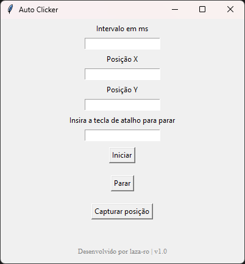

# 🖱️ Auto Clicker

Um Auto Clicker leve, eficiente e com interface gráfica amigável, desenvolvido inteiramente em Python. 

Criado originalmente para automatizar cliques repetitivos em jogos do tipo *Idle/Clicker* (como *Banana*, *How to grow your sausage*, etc.), poupando seu tempo e o seu mouse.



## ✨ Funcionalidades
- **Interface Gráfica (GUI):** Configuração simples e direta de coordenadas e intervalos.
- **Atalhos de Teclado (Kill-Switch):** Inicie e pare o clicker rapidamente usando o teclado, sem perder o controle do mouse.
- **Alta Performance:** Construído com `threading` para garantir que a interface não trave, mesmo rodando a milhares de cliques por segundo.
- **Portátil (Standalone):** Não requer instalação do Python. Basta baixar o `.exe` e rodar em qualquer máquina Windows.

## 🚀 Como Usar (Para Usuários)

Se você quer apenas usar o programa, não precisa instalar nada:

1. Vá até a aba **[Releases]** aqui no GitHub.
2. Baixe o arquivo `AutoClicker.exe` mais recente.
3. Dê um duplo clique e divirta-se!

> **Nota:** Como o programa é um `.exe` recém-compilado e simula cliques do mouse, o Windows Defender pode emitir um aviso de segurança. Isso é um falso positivo comum em ferramentas de automação gratuitas.

## 🛠️ Como Executar o Código (Para Desenvolvedores)

Se você quiser modificar o projeto ou rodar direto do código-fonte:

**Pré-requisitos:**
* Python 3.x instalado.

**Instalação das dependências:**
```bash
pip install pyautogui keyboard
```

**Arquitetura do Projeto:**
O projeto foi estruturado utilizando Programação Orientada a Objetos (POO) com separação de responsabilidades:

* **main.py**: Ponto de entrada e inicialização.
* **interface.py**: Gerenciamento da interface gráfica (tkinter).
* **motor.py**: Lógica de automação (pyautogui), atalhos (keyboard) e paralelismo (threading).

Como rodar:
```bash
python main.py
```
⚠️ Aviso Legal
Este projeto foi criado com fins educacionais e para uso em jogos casuais (Idle games). O uso desta ferramenta em jogos competitivos ou online pode violar os Termos de Serviço (TOS) dessas plataformas, resultando em banimentos. Use por sua própria conta e risco.

Desenvolvido por laza-ro | Versão 1.0